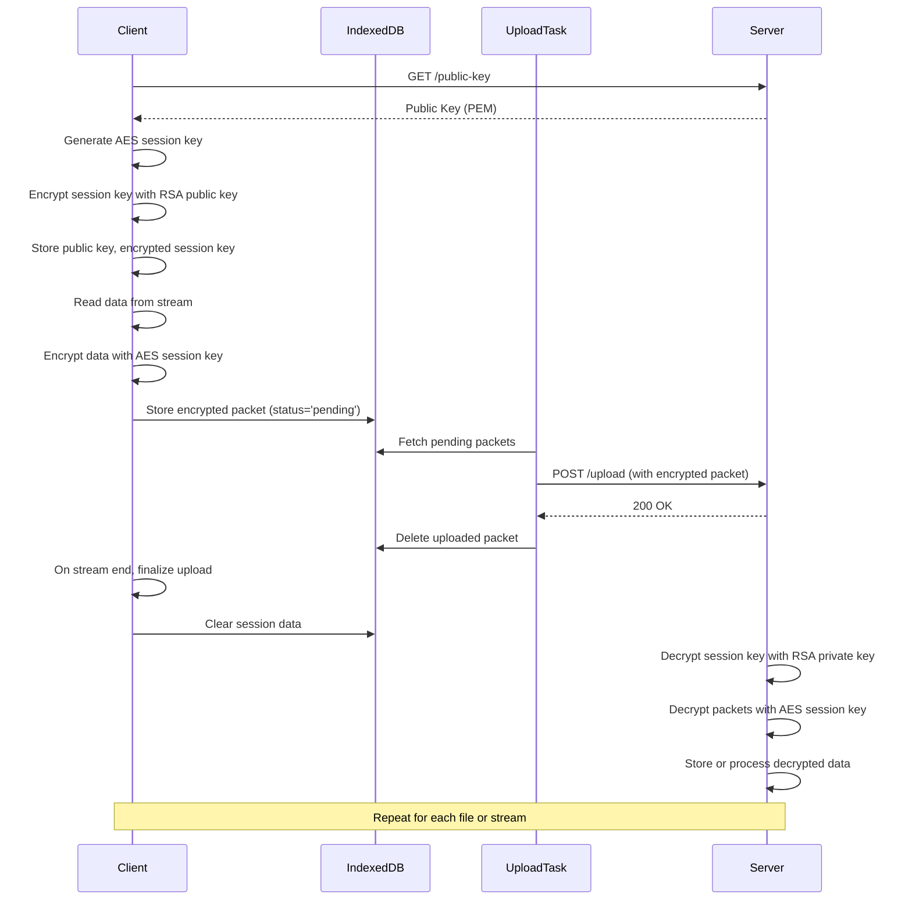

# indexedcp

**indexedcp** is a Node.js library and CLI toolset for secure, efficient, and resumable file transfer. By default, Node.js environments buffer uploads on disk (`~/.indexcp/db/chunks.json`) so transfers survive restarts, while browser builds fall back to IndexedDB for offline and resumable support.

🔐 **NEW:** [Asymmetric envelope encryption](#-encryption) protects data at rest with per-stream AES keys wrapped by RSA public keys.

---

## Features

- 🔄 Resumable and offline-friendly uploads
- 📦 Chunked streaming with persistent buffering (filesystem on Node, IndexedDB in browsers)
- 🔒 API key authentication
- 🔐 **Asymmetric encryption** - End-to-end encrypted storage with offline support
- 🛡️ Path traversal protection
- 📦 Separate client/server imports for minimal bundle size
- 🔧 Simple CLI tools

---

## Installation

```bash
npm install -g indexedcp
```

---

## Usage

### Quick Start for Browsers & Node.js
Minimal setup for a client to queue and send a stream encrypted.  Packets are kept in IndexedDB until confirmed by the server. The example starts a startUploadBackground() task that works to upload any packets in the background. Then it opens a MediaStream from the microphone, but any ReadableStream can be used.

```javascript
const IndexCPClient = require('indexedcp/lib/client');
const client = new IndexCPClient({
  serverUrl: 'http://localhost:3000',
  apiKey: 'your-key'
});

client.startUploadBackground();

navigator.mediaDevices.getUserMedia({ audio: true })
  .then(stream => {
    const reader = stream.getReader();
    client.sendStream(reader);
  })
  .catch(error => {
    console.error('Error accessing media devices.', error);
  });
```

### Quick Start for Servers

```javascript
const EncryptedServer = require('indexedcp/lib/encrypted-server');
const server = new EncryptedServer({
  port: 3000,
  apiKey: 'your-key'
});

server.start();
``` 

### CLI Examples

```bash
# Set API key
export INDEXCP_API_KEY=your-key

# Set log level (optional) - trace, debug, info, warn, error, fatal
export INDEXCP_LOG_LEVEL=info

# Start server
indexcp server --port 3000 --apiKey your-key
# Upload file
## cp style command line
indexcp file_to_upload http://localhost:3000
## explicit upload command
indexcp upload --server http://localhost:3000 [file1 file2 ...]
```

### Logging Configuration

Both the client and server support configurable log levels using the `console-log-level` package. You can control verbosity through environment variables or constructor options:

**Environment Variable:**
```bash
export INDEXCP_LOG_LEVEL=debug  # trace, debug, info, warn, error, fatal
```

**Client Configuration:**
```javascript
const client = new IndexCPClient({
  serverUrl: 'http://localhost:3000',
  apiKey: 'your-key',
  logLevel: 'debug'  // trace, debug, info, warn, error, fatal
});
```

**Server Configuration:**
```javascript
const server = new IndexCPServer({
  port: 3000,
  apiKey: 'your-key',
  logLevel: 'info'  // trace, debug, info, warn, error, fatal
});
```

**Log Levels:**
- `trace`: Most verbose - all debug information
- `debug`: Detailed information for debugging
- `info`: General informational messages (default)
- `warn`: Warning messages
- `error`: Error messages
- `fatal`: Critical errors only

## Documentation of API

### Diagram (sequence)


### API Client


### API Server

---

## License

MIT

---

## Contributing

Pull requests and issues welcome! Visit [bluehive.com/integrate](https://bluehive.com/integrate?utm_source=bluehive&utm_medium=chat&utm_campaign=bluehive-ai) for more information.
