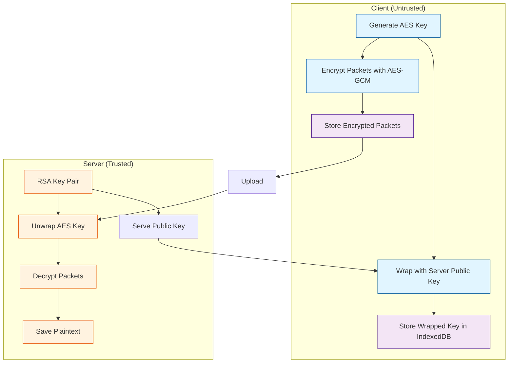

# IndexedDB Asymmetric Encryption

## Overview

IndexedCP now supports **asymmetric envelope encryption** with per-stream session keys, protecting locally stored data from being read by clients or attackers with local access. The system uses RSA-OAEP for key wrapping and AES-256-GCM for data encryption.

## Architecture



## Security Model

### Encryption Flow

1. **Key Generation**: Server generates RSA-4096 key pair on startup
2. **Key Distribution**: Client fetches server's public key (once)
3. **Session Start**: For each stream:
   - Generate ephemeral AES-256 key
   - Wrap AES key with server's public key (RSA-OAEP SHA-256)
   - Store wrapped key in IndexedDB
4. **Data Encryption**: For each packet:
   - Encrypt with AES-256-GCM using unique IV
   - Include metadata in AAD (sessionId, seq, codec, timestamp)
   - Store: `{ciphertext, iv, authTag, aad}`
5. **Upload**: Send `{wrappedKey, kid, ciphertext, iv, authTag, aad}`
6. **Decryption**: Server unwraps AES key and decrypts packets

### What's Protected

✅ **Protected at rest** (IndexedDB):
- Packet data (encrypted with AES-256-GCM)
- Session keys (wrapped with RSA public key)

✅ **Protected attributes**:
- Authenticity (GCM auth tag)
- Integrity (AAD binding)
- Uniqueness (per-packet IV)

❌ **NOT protected**:
- Metadata (sessionId, seq, timestamps are in AAD but visible)
- In-flight data in JavaScript memory
- XSS attacks (encryption protects storage, not memory)

### Threat Model

| Threat | Mitigation |
|--------|------------|
| Local storage dump | ✅ Data is encrypted with server's public key |
| Session key extraction | ✅ Only wrapped keys stored; unwrapped keys in memory only |
| Packet replay | ✅ AAD includes sessionId + seq for uniqueness |
| Packet modification | ✅ GCM auth tag ensures integrity |
| Man-in-the-middle | ⚠️ Use HTTPS for key fetch and uploads |
| XSS | ⚠️ Cannot protect against JavaScript memory access |
| Compromised server | ❌ Server has private key and can decrypt all data |

## Usage

### Server Setup

```javascript
const EncryptedServer = require('indexedcp/lib/encrypted-server');

const server = new EncryptedServer({
  outputDir: './uploads',
  port: 3000
});

// Server automatically generates RSA key pair on startup
await server.listen(3000);
```

### Key Persistence with Keystores

The server uses a **pluggable keystore** system to persist RSA key pairs across restarts. This ensures that rotated keys remain available to decrypt old client data (AC4 requirement).

#### Available Keystore Types

##### 1. FileSystem Keystore (Default)

Stores keys as JSON files on disk. No external dependencies required.

```javascript
const server = new EncryptedServer({
  outputDir: './uploads',
  port: 3000,
  keystoreType: 'filesystem',
  keystoreOptions: {
    keyStorePath: './server-keys'  // Default: ./server-keys
  }
});

await server.listen(3000);
```

**Storage**: Keys saved to `./server-keys/<kid>.json`

##### 2. MongoDB Keystore

Stores keys in a MongoDB collection with automatic indexing.

```javascript
const { MongoClient } = require('mongodb');

const mongoClient = await MongoClient.connect('mongodb://localhost:27017');

const server = new EncryptedServer({
  outputDir: './uploads',
  port: 3000,
  keystoreType: 'mongodb',
  keystoreOptions: {
    client: mongoClient,
    databaseName: 'indexedcp',      // Default: 'indexedcp'
    collectionName: 'server_keys'   // Default: 'server_keys'
  }
});

await server.listen(3000);

// Don't forget to close MongoDB connection on shutdown
process.on('SIGTERM', () => {
  server.close();
  mongoClient.close();
});
```

**Storage**: Keys saved to MongoDB with indexes on `kid` (unique) and `createdAt`

**Required package**: `npm install mongodb`

##### 3. Memory Keystore (Testing Only)

Stores keys in memory only - useful for testing. Keys are lost on restart.

```javascript
const server = new EncryptedServer({
  outputDir: './uploads',
  port: 3000,
  keystoreType: 'memory'
});

await server.listen(3000);
// ⚠️ Keys lost on restart!
```

#### Keystore Configuration

All keystores support these options in the `EncryptedServer` constructor:

```javascript
{
  keystoreType: 'filesystem' | 'mongodb' | 'memory',  // Default: 'filesystem'
  keystoreOptions: {
    // Filesystem options
    keyStorePath: './server-keys',
    
    // MongoDB options
    client: MongoClient,
    databaseName: 'indexedcp',
    collectionName: 'server_keys',
    
    // Memory options
    ephemeral: true  // Show warning messages
  },
  maxKeyAge: 90 * 24 * 60 * 60 * 1000  // Max key age in ms (default: 90 days)
}
```

#### Key Lifecycle

```mermaid
graph LR
    A[Server Start] --> B[Initialize Keystore]
    B --> C[Load Persisted Keys]
    C --> D{Keys Found?}
    D -->|Yes| E[Activate Latest Key]
    D -->|No| F[Generate New Key]
    F --> G[Persist to Keystore]
    E --> H[Server Ready]
    G --> H
    
    H --> I[Key Rotation]
    I --> J[Generate New Key]
    J --> K[Deactivate Old Key]
    K --> L[Persist Both Keys]
    L --> M[Cleanup Expired Keys]
    M --> H
    
    classDef startClass fill:#c8e6c9,stroke:#2e7d32
    classDef processClass fill:#fff9c4,stroke:#f57f17
    classDef storageClass fill:#bbdefb,stroke:#1565c0
    
    class A,H startClass
    class B,C,E,F,I,J,K,M processClass
    class G,L storageClass
```



#### Custom Keystore Implementation

You can implement custom keystores by extending `BaseKeyStore`:

```javascript
const { BaseKeyStore } = require('indexedcp/lib/keystores');

class RedisKeyStore extends BaseKeyStore {
  constructor(options) {
    super();
    this.redis = options.client;
  }
  
  async initialize() {
    await this.redis.ping();
  }
  
  async save(kid, keyData) {
    await this.redis.set(`key:${kid}`, JSON.stringify(keyData));
  }
  
  async load(kid) {
    const data = await this.redis.get(`key:${kid}`);
    return data ? JSON.parse(data) : null;
  }
  
  async loadAll() {
    const keys = await this.redis.keys('key:*');
    return Promise.all(keys.map(k => this.redis.get(k).then(JSON.parse)));
  }
  
  async delete(kid) {
    return await this.redis.del(`key:${kid}`) > 0;
  }
  
  async exists(kid) {
    return await this.redis.exists(`key:${kid}`) === 1;
  }
  
  async list() {
    const keys = await this.redis.keys('key:*');
    return keys.map(k => k.replace('key:', ''));
  }
  
  async close() {
    await this.redis.quit();
  }
}

// Use custom keystore
const server = new EncryptedServer({
  outputDir: './uploads',
  keyStore: new RedisKeyStore({ client: redisClient })
});
```

### Client Usage

#### Step 1: Fetch Public Key (AC0)

```javascript
const EncryptedClient = require('indexedcp/lib/encrypted-client');

const client = new EncryptedClient({
  serverUrl: 'http://localhost:3000',
  apiKey: 'your-api-key'
});

// Fetch and cache server's public key
await client.fetchPublicKey();
```

#### Step 2: Encrypt and Buffer Data (AC1)

```javascript
// Encrypt file - stores only encrypted packets in IndexedDB
await client.addFile('./sensitive-data.txt');

// Check status
const status = await client.getEncryptionStatus();
console.log(status);
// {
//   isEncrypted: true,
//   activeSessions: 1,
//   pendingPackets: 42,
//   cachedKeys: 1,
//   currentKeyId: 'a1b2c3d4e5f6g7h8'
// }
```

#### Step 3: Offline Operation (AC2)

```javascript
// After initial key fetch, client works offline
const offlineClient = new EncryptedClient({
  dbName: 'my-app',
  apiKey: 'your-api-key'
  // No serverUrl - offline mode
});

// Uses cached public key
await offlineClient.getCachedPublicKey();

// Encrypt and queue data offline
await offlineClient.addFile('./more-data.txt');
```

#### Step 4: Upload Encrypted Packets (AC3)

```javascript
// When online, upload all queued encrypted packets
const results = await client.uploadBufferedFiles('http://localhost:3000');
console.log(results);
// { './sensitive-data.txt': 'server-generated-filename.txt' }
```

### Key Rotation (AC4)

```javascript
// Server-side: Rotate keys without invalidating queued data
await server.rotateKeys();
// Old keys remain available for decrypting already-encrypted packets

// Client-side: Fetch new key for future encryptions
await client.fetchPublicKey();
```

## IndexedDB Schema

### Sessions Store

```javascript
{
  sessionId: string,        // Unique session identifier
  kid: string,              // Key ID used to wrap session key
  wrappedKey: string,       // RSA-encrypted AES key (base64)
  fileName: string,         // Original filename
  createdAt: number         // Timestamp
}
```

### Packets Store

```javascript
{
  id: string,               // `${sessionId}-${seq}`
  sessionId: string,        // Links to session
  seq: number,              // Sequence number
  ciphertext: string,       // Encrypted data (base64)
  iv: string,               // Initialization vector (base64)
  authTag: string,          // GCM authentication tag (base64)
  aad: string,              // Additional authenticated data (base64)
  status: string,           // 'pending' | 'uploaded'
  createdAt: number         // Timestamp
}
```

### Key Cache Store

```javascript
{
  kid: string,              // Key ID
  publicKey: string,        // Server's public key (PEM)
  fetchedAt: number,        // Cache timestamp
  expiresAt: number         // Key expiration
}
```

## Performance (AC5)

Benchmarks on reference system (MacBook Pro M1):

| Operation | Time | Throughput |
|-----------|------|------------|
| Key generation (server) | ~2000ms | Once per rotation |
| Key wrapping | ~5ms | Once per stream |
| Packet encryption (1MB) | ~50ms | ~20 MB/s |
| Packet decryption (1MB) | ~50ms | ~20 MB/s |

**Overhead**: Encryption adds ~100ms per MB compared to unencrypted mode, which is negligible for most use cases.

## API Reference

### EncryptedClient

#### Constructor

```javascript
new EncryptedClient(options)
```

Options:
- `dbName` (string): IndexedDB database name
- `apiKey` (string): API key for authentication
- `serverUrl` (string): Server base URL (optional for offline)
- `chunkSize` (number): Packet size in bytes (default: 1MB)

#### Methods

**`async fetchPublicKey(serverUrl?)`**
- Fetch server's public key and cache locally
- Required before first use (can work offline after)
- Returns: `{publicKey, kid, expiresAt}`

**`async getCachedPublicKey()`**
- Retrieve cached public key from IndexedDB
- Enables offline operation
- Returns: `{publicKey, kid, expiresAt}` or `null`

**`async startStream(fileName)`**
- Start a new encrypted streaming session
- Generates ephemeral AES key
- Returns: `sessionId`

**`async addPacket(sessionId, data, seq, metadata?)`**
- Encrypt and store a single packet
- Metadata: `{codec, timestamp}`

**`async addFile(filePath)`**
- Encrypt entire file as a stream
- Returns: `{sessionId, packets}`

**`async uploadBufferedFiles(serverUrl)`**
- Upload all pending encrypted packets
- Returns: Map of client filename → server filename

**`async getEncryptionStatus()`**
- Get encryption statistics
- Returns: `{isEncrypted, activeSessions, pendingPackets, cachedKeys, currentKeyId, keyExpiresAt}`

### EncryptedServer

#### Constructor

```javascript
new EncryptedServer(options)
```

Options:
- `outputDir` (string): Directory for decrypted files
- `port` (number): Server port
- `apiKey` (string): API key (auto-generated if not provided)
- `pathMode` (string): 'ignore' | 'sanitize' | 'allow-paths'

#### Methods

**`async generateKeyPair()`**
- Generate new RSA-4096 key pair
- Automatically called on server start
- Returns: `kid` (key ID)

**`getActivePublicKey()`**
- Get current active public key
- Returns: `{publicKey, kid, expiresAt}`

**`async rotateKeys()`**
- Generate new key and deactivate old (but keep for decryption)
- Returns: `kid` (new key ID)

**`getEncryptionStatus()`**
- Get server encryption state
- Returns: `{activeKeyId, totalKeys, activeSessions, keyDetails}`

**`async listen(port, callback)`**
- Start server with automatic key generation

#### Endpoints

**`GET /public-key`**
- Fetch server's public key
- No authentication required
- Response: `{publicKey, kid, expiresAt}`

**`POST /upload-encrypted`**
- Upload encrypted packet
- Requires API key
- Body: `{sessionId, seq, kid, wrappedKey, ciphertext, iv, authTag, aad, fileName}`
- Response: `{message, sessionId, seq, actualFilename}`

**`POST /rotate-keys`**
- Trigger key rotation
- Requires API key
- Response: `{message, kid}`

**`POST /upload`**
- Legacy unencrypted upload (still supported)

## Acceptance Criteria

✅ **AC0**: Fetch public key from server before starting streams  
✅ **AC1**: IndexedDB contains only encrypted packets and wrapped keys  
✅ **AC2**: Client functions offline after initial key fetch  
✅ **AC3**: Server successfully decrypts uploaded packets  
✅ **AC4**: Key rotation does not invalidate queued data  
✅ **AC5**: Performance overhead is negligible (< 100ms/MB)  

## Testing

Run the encryption test suite:

```bash
npm run test:encryption
# or
node tests/test-encryption.js
```

Tests cover:
- Public key fetch and caching
- No plaintext in IndexedDB
- Offline operation
- End-to-end encryption/decryption
- Key rotation
- Performance benchmarks
- IV uniqueness
- Session key memory management

## Security Best Practices

### For Deployment

1. **Use HTTPS**: Encrypt key fetch and uploads in transit
2. **Rotate keys regularly**: Monthly or quarterly
3. **Secure API keys**: Use environment variables, not hardcoded
4. **Monitor key expiration**: Implement key refresh logic
5. **Rate limit**: Prevent key fetch abuse
6. **Audit logs**: Track encryption/decryption operations

### For Developers

1. **Never log session keys**: Only log wrapped keys and key IDs
2. **Clear sensitive data**: Session keys are auto-cleared after streams
3. **Validate inputs**: Always verify `kid`, `sessionId`, and packet structure
4. **Handle rotation gracefully**: Support multiple overlapping key versions
5. **Test offline mode**: Ensure cached keys work without connectivity

## Troubleshooting

### "No public key available"
- Ensure server is running
- Call `fetchPublicKey()` before encrypting data
- Check cached keys with `getCachedPublicKey()`

### "Unknown key ID: xxx"
- Server restarted and lost keys (keys not persisted)
- Implement key persistence if needed
- Client must re-fetch public key

### "Decryption failed"
- Packet corruption or tampering
- Wrong key used (check `kid` matches)
- AAD mismatch (metadata altered)

### Performance issues
- Reduce chunk size for faster encryption
- Use streaming for large files
- Consider worker threads for encryption

## Migration from Unencrypted

To migrate from unencrypted IndexedCP:

1. **New clients**: Use `EncryptedClient` instead of `IndexedCPClient`
2. **Server upgrade**: Switch to `EncryptedServer` (backward compatible)
3. **Database**: New schema (`indexcp-encrypted` vs `indexcp`)
4. **Gradual rollout**: Both clients can coexist (different DB names)

No data migration needed—old and new systems use separate databases.

## License

MIT

## See Also

- [Cryptographic Details](./ENCRYPTION-CRYPTO.md) (for security researchers)
- [Examples](../examples/) - Working code samples
- [Main README](../README.md) - Project overview
