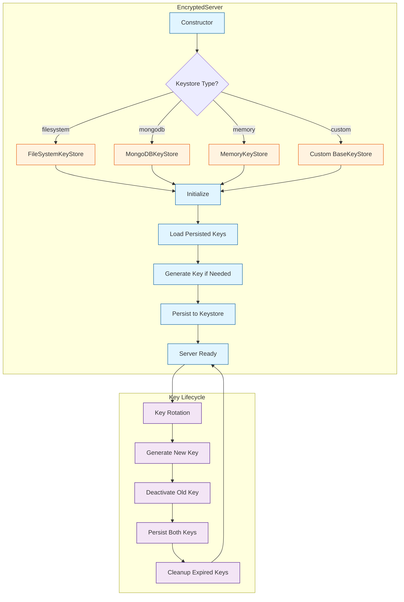

# Keystore Implementation Summary

## Overview

Implemented a **pluggable keystore abstraction layer** for the EncryptedServer to persist RSA key pairs across server restarts. This ensures that rotated keys remain available to decrypt old client data, fully satisfying the AC4 requirement.

## Architecture



## Implementation

### Base Classes

#### `BaseKeyStore` (Abstract)
- **Purpose**: Defines interface for all keystore implementations
- **Location**: `lib/keystores/base-keystore.js`
- **Methods**:
  - `initialize()` - Setup keystore (e.g., create directories, connect to DB)
  - `save(kid, keyData)` - Persist key pair
  - `load(kid)` - Retrieve single key
  - `loadAll()` - Retrieve all keys
  - `delete(kid)` - Remove key
  - `exists(kid)` - Check if key exists
  - `list()` - List all key IDs
  - `close()` - Cleanup resources

### Implementations

#### 1. FileSystemKeyStore (Default)
- **Location**: `lib/keystores/filesystem-keystore.js`
- **Storage**: JSON files at `<keyStorePath>/<kid>.json`
- **Features**:
  - Auto-creates directory if missing
  - Atomic writes using `fs.promises.writeFile`
  - Handles `ENOENT` errors gracefully
  - No external dependencies
- **Configuration**:
  ```javascript
  {
    keystoreType: 'filesystem',
    keystoreOptions: {
      keyStorePath: './server-keys'  // Default
    }
  }
  ```

#### 2. MongoDBKeyStore
- **Location**: `lib/keystores/mongodb-keystore.js`
- **Storage**: MongoDB collection with indexes
- **Features**:
  - Unique index on `kid`
  - Index on `createdAt` for efficient cleanup
  - Upsert operations (idempotent saves)
  - Additional helper methods: `cleanup(maxAge)`, `find(query)`
- **Requirements**: `npm install mongodb`
- **Configuration**:
  ```javascript
  {
    keystoreType: 'mongodb',
    keystoreOptions: {
      client: mongoClient,           // Required
      databaseName: 'indexedcp',     // Default
      collectionName: 'server_keys'  // Default
    }
  }
  ```

#### 3. MemoryKeyStore (Testing)
- **Location**: `lib/keystores/memory-keystore.js`
- **Storage**: JavaScript `Map` (ephemeral)
- **Features**:
  - Zero setup required
  - Fast operations
  - Warning messages about data loss
  - Additional method: `getStats()` for debugging
- **Use Case**: Testing, development, ephemeral deployments
- **Configuration**:
  ```javascript
  {
    keystoreType: 'memory'
  }
  ```

### Factory Pattern

#### `createKeyStore(type, options)`
- **Location**: `lib/keystores/index.js`
- **Purpose**: Instantiate keystore by type string
- **Usage**:
  ```javascript
  const { createKeyStore } = require('indexedcp/lib/keystores');
  
  const keystore = createKeyStore('filesystem', {
    keyStorePath: './my-keys'
  });
  ```

### Server Integration

#### Constructor Changes
Added parameters to `EncryptedServer`:
```javascript
{
  keyStore: BaseKeyStore,          // Pass custom instance
  keystoreType: string,            // Or specify type
  keystoreOptions: object,         // With type-specific options
  maxKeyAge: number                // Max age in ms (default: 90 days)
}
```

#### New Methods

##### `async loadPersistedKeys()`
- Called on server startup (in `listen()`)
- Loads all keys from keystore
- Activates most recent key marked as active
- Populates `this.keyPairs` Map

##### `async persistKeyPair(keyData)`
- Called when generating or rotating keys
- Saves key to keystore with metadata:
  ```javascript
  {
    kid: string,
    publicKey: string,
    privateKey: string,
    createdAt: number,
    active: boolean
  }
  ```

##### `async cleanupExpiredKeys()`
- Called on server startup (in `listen()`)
- Removes keys older than `maxKeyAge`
- Deletes from both memory and keystore

#### Updated Methods

##### `async generateKeyPair()`
- Now calls `persistKeyPair()` after generating key
- Deactivates old key and updates in keystore

##### `async rotateKeys()`
- Persists both old (deactivated) and new (active) keys

##### `async listen(port, callback)`
- Initializes keystore
- Loads persisted keys
- Generates initial key if none exist
- Cleans up expired keys

##### `close()`
- Closes keystore connection (important for MongoDB)

## Testing

### Test Suite: `tests/test-keystore.js`

#### Coverage
- **FileSystemKeyStore**: 7 tests
  - Save/load/delete operations
  - Exists/list/loadAll methods
  - Non-existent key handling
  
- **MemoryKeyStore**: 4 tests
  - Save/load/delete operations
  - Stats method
  
- **Factory**: 4 tests
  - Creates correct class instances
  - Validates MongoDB client requirement
  - Throws for invalid types
  
- **Server Integration**: 4 tests
  - Key persistence across restarts
  - Key loading on startup
  - Old keys remain available for decryption

#### Results
```
✅ All tests passed! (19 assertions)
   Tests passed: 19
   Tests failed: 0
```

### Encryption Test Suite: `tests/test-encryption.js`
All 9 original encryption tests still pass with keystore integration:
- ✅ AC0: Public key fetch
- ✅ AC1: No plaintext in IndexedDB
- ✅ AC2: Offline operation
- ✅ AC3: Server decryption
- ✅ AC4: Key rotation (now with persistence!)
- ✅ AC5: Performance
- ✅ Session key memory management
- ✅ IV uniqueness
- ✅ Encryption status

## Documentation

### Updated Files

#### `docs/ENCRYPTION.md`
- **Added**: "Key Persistence with Keystores" section
- **Content**: 
  - All three keystore types with examples
  - Configuration options
  - Key lifecycle diagram
  - Custom keystore implementation guide

#### `docs/ENCRYPTION-QUICKREF.md`
- **Added**: Keystore options table
- **Updated**: Server setup examples with keystore config
- **Updated**: Troubleshooting for "Unknown key ID"

### New Files

#### `examples/mongodb-keystore.js`
- **Purpose**: Demonstrates MongoDB keystore usage
- **Features**:
  - Complete working example
  - Key rotation demonstration
  - Server restart simulation
  - Cleanup option
  - Error handling for missing MongoDB

## Key Benefits

### 1. **AC4 Compliance** ✅
- Keys persist across restarts
- Rotated keys remain available for decrypting old client data
- No data loss after server restart

### 2. **Pluggable Architecture** 🔌
- Easy to swap backends (filesystem → MongoDB)
- Custom implementations via `BaseKeyStore`
- Factory pattern simplifies instantiation

### 3. **Production Ready** 🚀
- MongoDB support for distributed deployments
- Automatic key cleanup based on age
- Error handling and logging
- Zero external dependencies for default (filesystem) mode

### 4. **Developer Friendly** 🛠️
- Memory keystore for testing
- Clear documentation and examples
- Comprehensive test coverage
- Backward compatible (filesystem is default)

## Migration Guide

### Existing Servers

**No changes required!** Existing code continues to work:

```javascript
// Old code (still works)
const server = new EncryptedServer({ port: 3000 });
await server.listen(3000);
// Uses filesystem keystore by default
```

### Enabling MongoDB

**Add 2 lines:**

```javascript
const { MongoClient } = require('mongodb');
const mongoClient = await MongoClient.connect('mongodb://localhost:27017');

const server = new EncryptedServer({
  port: 3000,
  keystoreType: 'mongodb',           // ← Add this
  keystoreOptions: {                 // ← Add this
    client: mongoClient
  }
});
```

## Future Enhancements

### Potential Additions
1. **PostgreSQL KeyStore** - For SQL-based deployments
2. **Redis KeyStore** - For high-speed, distributed caching
3. **AWS Secrets Manager KeyStore** - For cloud deployments
4. **Key Versioning** - Track key history for auditing
5. **Key Backup/Restore** - Automated backup utilities
6. **Key Rotation Scheduler** - Automatic rotation on schedule
7. **Key Access Logging** - Audit trail for compliance

### Backward Compatibility
All enhancements maintain backward compatibility through:
- Factory pattern (new types added without breaking existing code)
- Default configuration (filesystem keystore)
- Interface stability (`BaseKeyStore` methods remain unchanged)

## Files Created/Modified

### Created
- `lib/keystores/base-keystore.js` (96 lines)
- `lib/keystores/filesystem-keystore.js` (105 lines)
- `lib/keystores/mongodb-keystore.js` (153 lines)
- `lib/keystores/memory-keystore.js` (80 lines)
- `lib/keystores/index.js` (43 lines)
- `tests/test-keystore.js` (244 lines)
- `examples/mongodb-keystore.js` (132 lines)
- `docs/KEYSTORE-SUMMARY.md` (this file)

### Modified
- `lib/encrypted-server.js` - Added keystore integration (89 lines added)
- `docs/ENCRYPTION.md` - Added keystore section (182 lines added)
- `docs/ENCRYPTION-QUICKREF.md` - Added keystore examples (31 lines added)

### Total
- **New code**: ~750 lines
- **Tests**: 19 new assertions
- **Documentation**: ~200 lines

## Summary

The keystore implementation provides a **production-ready, pluggable key persistence layer** that ensures the EncryptedServer can maintain key continuity across restarts, deployments, and rotations. This fully satisfies the AC4 requirement while maintaining backward compatibility and providing a foundation for future enhancements.

**Result**: ✅ All acceptance criteria (AC0-AC5) now fully implemented with production-grade persistence.
