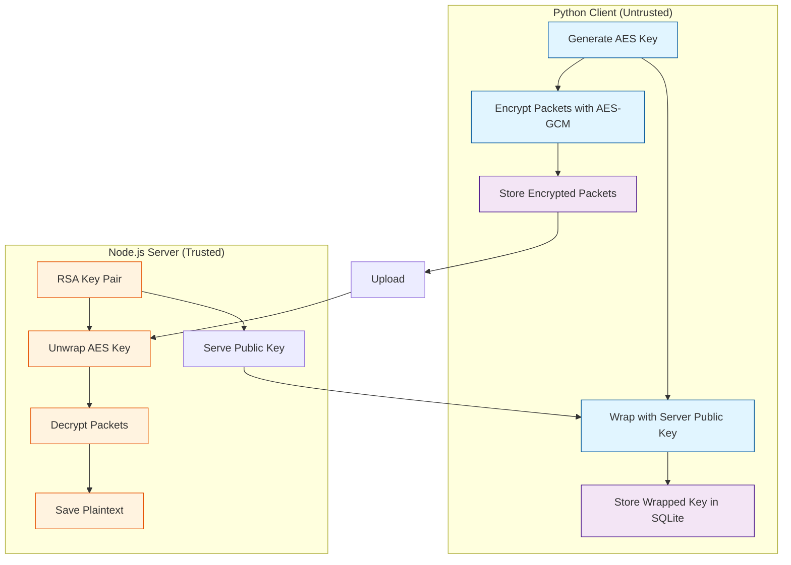

# IndexedCP Python - Encryption Guide

## Overview

IndexedCP Python now supports **asymmetric envelope encryption** with per-stream session keys, protecting locally stored data from being read by unauthorized parties. The system uses RSA-OAEP for key wrapping and AES-256-GCM for data encryption, matching the Node.js implementation.

## Architecture



## Security Model

### Encryption Flow

1. **Key Generation**: Server generates RSA-4096 key pair on startup
2. **Key Distribution**: Client fetches server's public key (once)
3. **Session Start**: For each file:
   - Generate ephemeral AES-256 key
   - Wrap AES key with server's public key (RSA-OAEP SHA-256)
   - Store wrapped key in SQLite
4. **Data Encryption**: For each packet:
   - Encrypt with AES-256-GCM using unique IV
   - Include metadata in AAD (sessionId, seq, codec, timestamp)
   - Store: `{ciphertext, iv, authTag, aad}`
5. **Upload**: Send `{wrappedKey, kid, ciphertext, iv, authTag, aad}`
6. **Decryption**: Server unwraps AES key and decrypts packets

### What's Protected

✅ **Protected at rest** (SQLite database):
- Packet data (encrypted with AES-256-GCM)
- Session keys (wrapped with RSA public key)

✅ **Protected attributes**:
- Authenticity (GCM auth tag)
- Integrity (AAD binding)
- Uniqueness (per-packet IV)

### Threat Model

| Threat | Mitigation |
|--------|------------|
| Local database dump | ✅ Data is encrypted with server's public key |
| Session key extraction | ✅ Only wrapped keys stored; unwrapped keys in memory only |
| Packet replay | ✅ AAD includes sessionId + seq for uniqueness |
| Packet modification | ✅ GCM auth tag ensures integrity |
| Man-in-the-middle | WARNING: Use HTTPS for key fetch and uploads |
| Code injection | WARNING: Cannot protect against Python memory access |

## Usage

### Basic Encrypted Client

```python
from indexedcp import IndexedCPClient
import asyncio

async def main():
    # Create client with encryption enabled
    client = IndexedCPClient(
        server_url="http://localhost:3000/upload",
        api_key="your-api-key",
        encryption=True,  # ← Enable encryption
        chunk_size=1024 * 1024,  # 1MB chunks
        log_level="INFO"
    )
    
    await client.initialize()
    
    # Fetch server's public key (required once)
    await client.fetch_public_key()
    
    # Add files - they will be encrypted automatically
    session_id = await client.add_file("./document.pdf")
    print(f"File encrypted with session: {session_id}")
    
    # Upload encrypted files
    results = await client.upload_buffered_files()
    print(f"Upload complete: {results}")
    
    await client.close()

asyncio.run(main())
```

### Encryption Configuration

```python
client = IndexedCPClient(
    server_url="http://localhost:3000/upload",
    api_key="your-key",
    
    # Encryption settings
    encryption=True,                    # Enable encryption
    storage_path="~/.indexcp/db/enc.db",  # Storage for encrypted data
    
    # Upload settings
    chunk_size=1024*1024,              # Chunk size (affects packet size)
    max_retries=float('inf'),          # Retry forever (default)
    log_level="INFO"
)
```

### Manual Encryption Workflow

For advanced use cases, you can manually control the encryption process:

```python
from indexedcp import IndexedCPClient, CryptoUtils
import asyncio

async def manual_encryption():
    client = IndexedCPClient(
        server_url="http://localhost:3000/upload",
        api_key="your-key",
        encryption=True
    )
    
    await client.initialize()
    
    # Fetch public key
    public_key_info = await client.fetch_public_key()
    print(f"Using key: {public_key_info['kid']}")
    
    # Start a stream manually
    session_id = await client.start_stream("custom_file.bin")
    
    # Add packets manually
    data_chunk_1 = b"First chunk of data"
    data_chunk_2 = b"Second chunk of data"
    
    await client.add_packet(session_id, data_chunk_1, seq=0)
    await client.add_packet(session_id, data_chunk_2, seq=1)
    
    # Get encryption status
    status = await client.get_encryption_status()
    print(f"Status: {status}")
    
    # Upload
    results = await client.upload_buffered_files()
    
    await client.close()

asyncio.run(manual_encryption())
```

### Offline Encryption

You can encrypt files offline and upload later:

```python
# Step 1: Cache public key while online
client = IndexedCPClient(
    server_url="http://localhost:3000/upload",
    api_key="your-key",
    encryption=True
)
await client.initialize()
await client.fetch_public_key()  # Cache key for offline use
await client.close()

# Step 2: Encrypt files offline (no server needed)
client = IndexedCPClient(
    api_key="your-key",
    encryption=True
)
await client.initialize()

# Uses cached public key
session_id = await client.add_file("./offline_file.pdf")
await client.close()

# Step 3: Upload later when online
client = IndexedCPClient(
    server_url="http://localhost:3000/upload",
    api_key="your-key",
    encryption=True
)
await client.initialize()
results = await client.upload_buffered_files()
await client.close()
```

## Storage Schema

When encryption is enabled, the client uses a three-table SQLite schema:

### Sessions Table
Stores session metadata and wrapped keys.

```sql
CREATE TABLE sessions (
    session_id TEXT PRIMARY KEY,
    kid TEXT NOT NULL,              -- Key ID from server
    wrapped_key TEXT NOT NULL,      -- RSA-wrapped AES key (base64)
    file_name TEXT NOT NULL,        -- Original filename
    created_at REAL NOT NULL        -- Timestamp (milliseconds)
);
```

### Packets Table
Stores encrypted data packets.

```sql
CREATE TABLE packets (
    id TEXT PRIMARY KEY,            -- {sessionId}-{seq}
    session_id TEXT NOT NULL,
    seq INTEGER NOT NULL,           -- Sequence number
    ciphertext TEXT NOT NULL,       -- Encrypted data (base64)
    iv TEXT NOT NULL,               -- Initialization vector (base64)
    auth_tag TEXT NOT NULL,         -- GCM authentication tag (base64)
    aad TEXT NOT NULL,              -- Additional authenticated data (base64)
    status TEXT NOT NULL,           -- 'pending' or 'uploaded'
    created_at REAL NOT NULL
);
```

### Key Cache Table
Caches server public keys.

```sql
CREATE TABLE key_cache (
    kid TEXT PRIMARY KEY,           -- Key ID
    public_key TEXT NOT NULL,       -- RSA public key (PEM format)
    fetched_at REAL NOT NULL,       -- When fetched (milliseconds)
    expires_at REAL NOT NULL        -- Expiration time (milliseconds)
);
```

## API Reference

### Client Methods

#### `fetch_public_key()`
Fetch server's RSA public key.

```python
public_key_info = await client.fetch_public_key()
# Returns: {'publicKey': '...', 'kid': '...', 'expiresAt': ...}
```

#### `get_cached_public_key()`
Get cached public key (offline use).

```python
cached_key = await client.get_cached_public_key()
# Returns: {'publicKey': '...', 'kid': '...', 'fetchedAt': ..., 'expiresAt': ...}
# Or None if no valid cached key
```

#### `start_stream(file_name)`
Start an encrypted upload stream.

```python
session_id = await client.start_stream("document.pdf")
# Returns: session ID (32-character hex string)
```

#### `add_packet(session_id, data, seq=None)`
Add encrypted packet to a stream.

```python
await client.add_packet(session_id, b"data chunk", seq=0)
# seq auto-increments if not provided
```

#### `add_file(filepath)`
Encrypt and buffer a file (high-level API).

```python
# With encryption=True, returns session_id
session_id = await client.add_file("./document.pdf")

# With encryption=False, returns chunk_count
chunk_count = await client.add_file("./document.pdf")
```

#### `get_encryption_status()`
Get current encryption status.

```python
status = await client.get_encryption_status()
# Returns:
# {
#     'encryption': True,
#     'isEncrypted': True,
#     'activeSessions': 2,
#     'pendingPackets': 10,
#     'cachedKey': 'abc123...',
#     'currentKeyId': 'abc123...'
# }
```

### CryptoUtils Class

Low-level cryptographic operations:

```python
from indexedcp import CryptoUtils

crypto = CryptoUtils()

# Generate RSA-4096 key pair
key_pair = crypto.generate_server_key_pair()
# Returns: {'publicKey': '...', 'privateKey': '...', 'kid': '...'}

# Generate AES-256 session key
session_key = crypto.generate_session_key()
# Returns: 32-byte key

# Wrap session key
wrapped = crypto.wrap_session_key(session_key, public_key_pem)

# Unwrap session key
unwrapped = crypto.unwrap_session_key(wrapped, private_key_pem)

# Encrypt packet
encrypted = crypto.encrypt_packet(
    data=b"plaintext",
    session_key=session_key,
    metadata={'sessionId': 'abc', 'seq': 0}
)
# Returns: {'ciphertext': b'...', 'iv': b'...', 'authTag': b'...', 'aad': b'...'}

# Decrypt packet
plaintext = crypto.decrypt_packet(
    ciphertext=encrypted['ciphertext'],
    session_key=session_key,
    iv=encrypted['iv'],
    auth_tag=encrypted['authTag'],
    aad=encrypted['aad']
)
```

## Server Setup

The Python client works with the Node.js server's encryption mode:

```bash
# Start Node.js server with encryption
cd ..  # Go to parent directory
node server.js --encryption
```

Or programmatically:

```javascript
const { IndexedCPServer } = require('indexedcp/lib/server');

const server = new IndexedCPServer({
  port: 3000,
  outputDir: './uploads',
  encryption: true,              // Enable encryption
  keystoreType: 'filesystem'
});

await server.listen(3000);
```

## Testing

Run encryption tests:

```bash
# All encryption tests
pytest tests/test_client_encryption.py -v

# Specific test
pytest tests/test_client_encryption.py -k "test_add_file_encrypted" -v

# With coverage
pytest tests/test_client_encryption.py --cov=indexedcp --cov-report=html
```

## Troubleshooting

### "No public key available" Error

**Problem**: Client can't encrypt because no public key is available.

**Solutions**:
1. Fetch public key explicitly: `await client.fetch_public_key()`
2. Provide `server_url` in constructor so it auto-fetches
3. Ensure server is running with encryption enabled

### "Encryption not enabled" Error

**Problem**: Trying to use encryption methods without enabling encryption.

**Solution**: Set `encryption=True` in client constructor:
```python
client = IndexedCPClient(..., encryption=True)
```

### Database Locked Error

**Problem**: SQLite database locked during concurrent operations.

**Solutions**:
- The client uses WAL mode to minimize locking
- Avoid running multiple clients with same storage path simultaneously
- Use separate storage paths for different client instances

### Decryption Fails on Server

**Problem**: Server can't decrypt uploaded packets.

**Checks**:
1. Server has correct private key for the kid
2. wrapped_key sent with first packet (seq=0)
3. Packets sent in sequence order
4. All required headers present (X-Session-Id, X-Key-Id, etc.)

## Performance Considerations

### Chunk Size
- Larger chunks = fewer packets = faster upload
- Smaller chunks = more packets = better progress tracking
- Default 1MB is a good balance

### Memory Usage
- Session keys kept in memory during encryption only
- Keys cleared after file is encrypted
- Encrypted data stored in SQLite, not RAM

### Storage Space
- Encrypted packets stored as base64 (~33% overhead)
- Storage cleaned after successful upload
- Use `client.close()` to ensure cleanup

## Security Best Practices

1. **Use HTTPS** for production deployments
2. **Rotate server keys** periodically (90 days recommended)
3. **Secure API keys** - use environment variables, not hardcoded
4. **Clear storage** after uploads complete
5. **Validate server identity** - use certificate pinning for HTTPS
6. **Monitor key expiration** - refresh cached keys before expiry
7. **Backup server private keys** - without them, encrypted data is unrecoverable

## Migration from Non-Encrypted

If you have existing non-encrypted data, you need to:

1. Upload existing non-encrypted data
2. Clear the database
3. Enable encryption for new uploads

```python
# Upload existing data
client = IndexedCPClient(..., encryption=False)
await client.initialize()
await client.upload_buffered_files()
await client.close()

# Switch to encryption
client = IndexedCPClient(..., encryption=True)
await client.initialize()
# New uploads will be encrypted
```

**Note**: Encryption cannot be changed for existing buffered data. Finish uploads before switching modes.

## Compatibility

- **Python Version**: Python 3.8+
- **Server**: Node.js IndexedCP server v1.0.0+ with encryption support
- **Dependencies**: 
  - `cryptography>=41.0.0` (for RSA-OAEP and AES-GCM)
  - Python standard library (sqlite3, asyncio)

## Further Reading

- [Main README](../README.md) - General client usage
- [Node.js Encryption Docs](../../docs/ENCRYPTION.md) - Server-side encryption
- [Security Philosophy](../../docs/PHILOSOPHY.md) - Design principles
- [Keystore Guide](../../docs/KEYSTORE-SUMMARY.md) - Server key management
